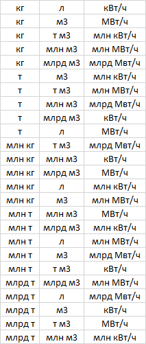

Описание:
Возможно использование следующих единиц измерения: 
O = ["кг", "тонн", "млн кг", "млн тонн", "млрд тонн"]
N = ["л", "м³", "тыс м³", "млн м³", "млрд м³"]
z = ["кВт⋅ч", "МВт⋅ч", "млн кВт⋅ч", "млн МВт⋅ч", "млрд МВт⋅ч"]
Возможно использование попарных значений для теста.

+ 1 пользователь с пустыми значениями.

TESTCASE # 1

Preconditions: Создан пользователь 1 с нулевым эковкладом.

STR:
1. Открыть сайт https://www.avito.ru/avito-care/eco-impact
2. Авторизоваться на сайте пользователем из Preconditions

ER: На счетчиках будут нулевые значения, минимальные возможные единицы измерения.

TESTCASE # 2

Preconditions: Создан пользователь 2 с эковкладом в литрах и кВт. Значения выбраны с использованием техники граничных значений.

STR:
1. Открыть сайт https://www.avito.ru/avito-care/eco-impact
2. Авторизоваться на сайте пользователем из Preconditions

ER: На счетчиках будут значения, соответствующие значениям из ЛК пользователя. Единицы измерения: л, кВт.

TESTCASE # 3

Preconditions: Создан пользователь 3 с эковкладом в м3 и кВт

STR:
1. Открыть сайт https://www.avito.ru/avito-care/eco-impact
2. Авторизоваться на сайте пользователем из Preconditions

ER: На счетчиках будут значения, соответствующие значениям из ЛК пользователя. Единицы измерения: м3, кВт. Значения выбраны с использованием техники граничных значений.

TESTCASE # 4

Preconditions: Создан пользователь 4 с эковкладом в л и Вт. Значения выбраны с использованием техники граничных значений.

STR:
1. Открыть сайт https://www.avito.ru/avito-care/eco-impact
2. Авторизоваться на сайте пользователем из Preconditions

ER: На счетчиках будут значения, соответствующие значениям из ЛК пользователя. Единицы измерения: л, Вт.

TESTCASE # 5 - TESTCASE # 26 по тому же принципу.